# MultiSpaceAI: 多模态大语言模型

MultiSpaceAI 是一个高级多模态大语言模型系统，能够处理文本、图像和语音输入，实现复杂的跨模态理解与生成任务。


## 项目介绍

MultiSpaceAI 旨在建立一个全面的多模态智能系统，集成文本、图像和语音三种核心模态的理解与生成能力，实现复杂场景下的智能交互。系统采用先进的深度学习架构，包括Transformer、Vision Transformer和Conformer，实现高效的多模态融合与处理。系统支持与DeepSeek-API、Stable Diffusion、Whisper等先进AI模型的无缝集成，可混合使用自定义模型和API服务的能力。

## 核心特性

- **多模态融合处理**：同时处理文本、图像和语音输入
- **跨模态理解**：通过先进的多头交叉注意力实现模态间的深度融合
- **高质量生成**：基于融合表示生成高质量的多模态输出
- **高效推理**：优化的模型架构和推理策略，支持实时应用
- **扩展性强**：模块化设计，支持新模态和新功能的灵活扩展
- **API集成**：支持与DeepSeek、Stable Diffusion、Whisper等先进AI模型API的集成

## 系统架构

系统主要由以下模块组成：

1. **文本编码器**：处理和编码文本输入（可选择自定义模型或DeepSeek-API）
2. **图像编码器**：处理和编码图像输入（可选择自定义模型或Diffusion模型API）
3. **语音编码器**：处理和编码语音输入（可选择自定义模型或Whisper API）
4. **多模态融合模块**：整合不同模态的特征表示
5. **解码器模块**：基于融合的特征生成输出
6. **输出层**：根据任务需求生成最终结果

详细的系统设计请参考[设计文档](multimodal_llm_design_doc.md)。

# MultiSpaceAI 系统架构

本文档描述了 MultiSpaceAI 的系统架构，包括总体架构和各个模块的流程图。

## 总体架构

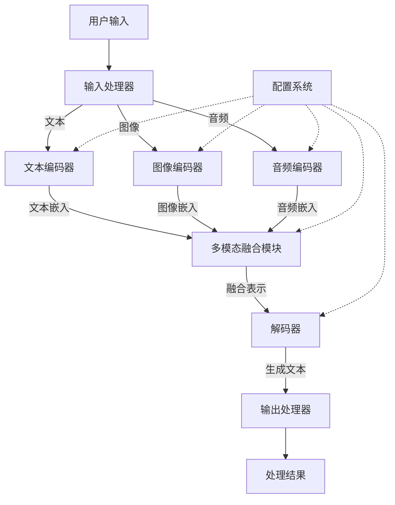

MultiSpaceAI 的总体架构由以下主要组件组成：

1. **输入处理器**：接收并预处理用户的多模态输入（文本、图像、音频）
2. **文本编码器**：将文本输入编码为高维嵌入
3. **图像编码器**：将图像输入编码为高维嵌入
4. **音频编码器**：将音频输入编码为高维嵌入
5. **多模态融合模块**：将不同模态的嵌入融合为统一表示
6. **解码器**：基于融合表示生成输出文本
7. **输出处理器**：处理和格式化最终结果
8. **配置系统**：为各个模块提供配置参数

## 输入处理流程

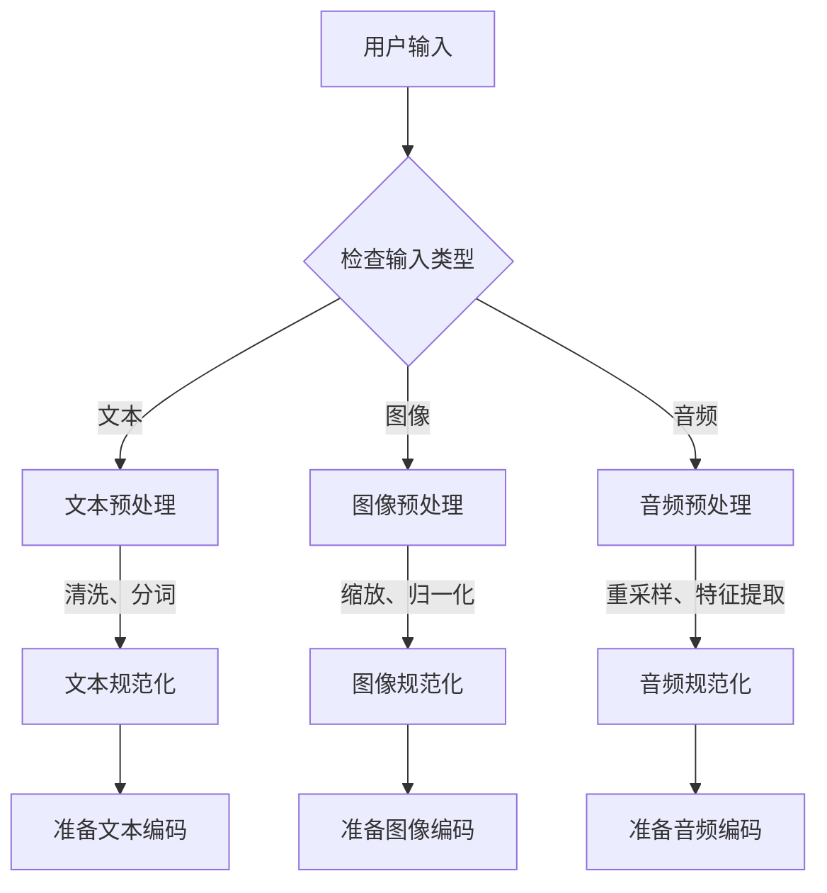

## 文本编码器模块

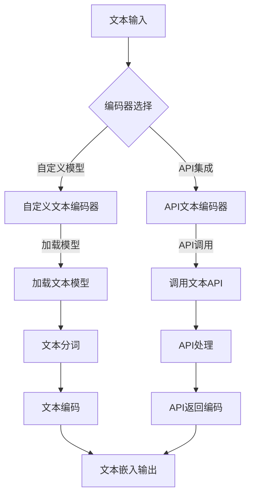

## 图像编码器模块

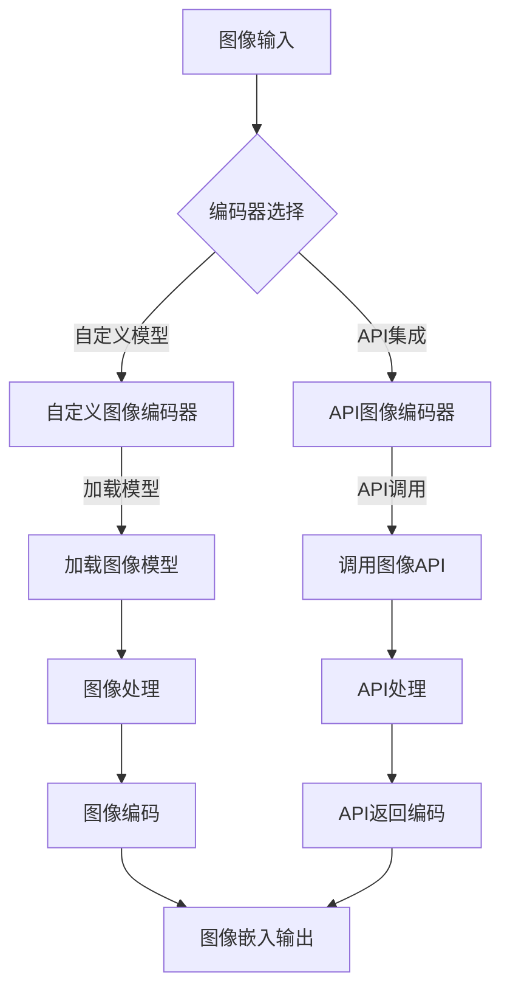

## 音频编码器模块

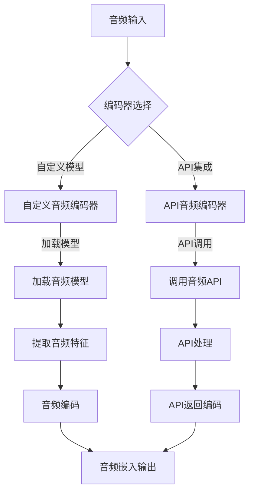

## 多模态融合模块

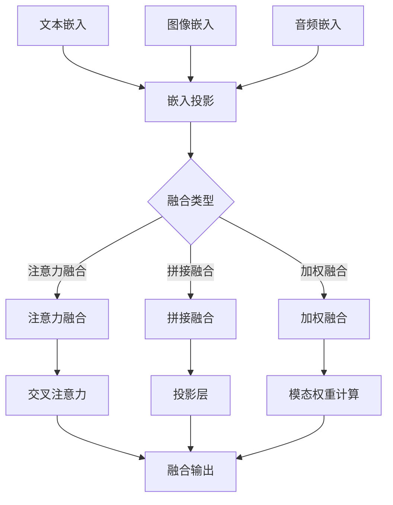

## 解码器模块

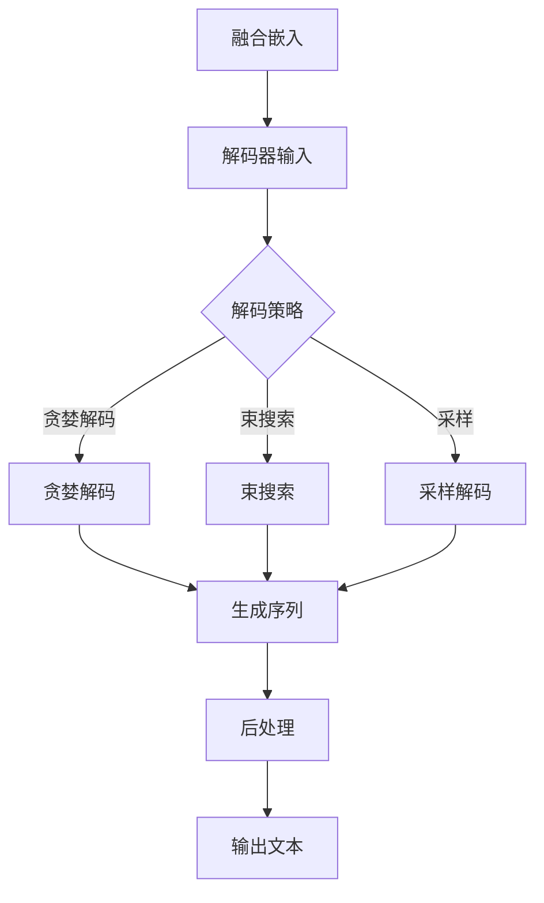

## 配置系统

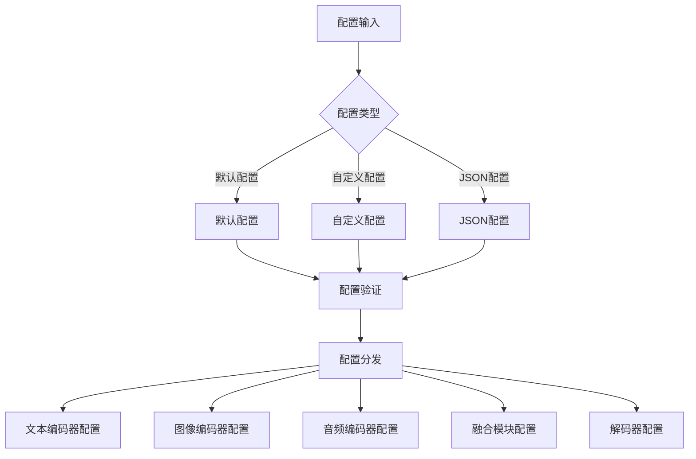

## 数据流程

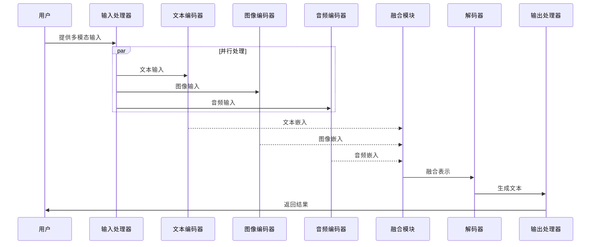

## 模型训练流程

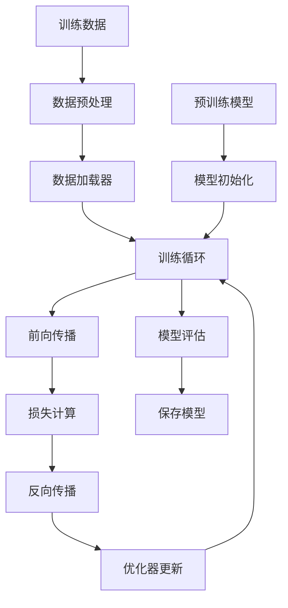

## API集成架构

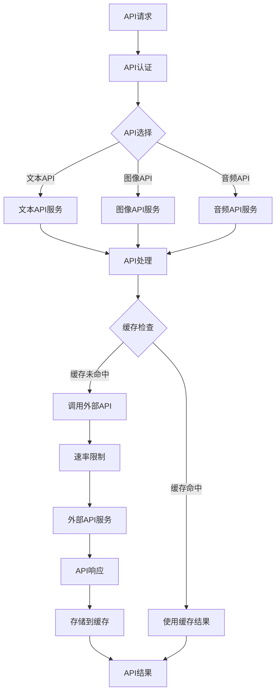

## 应用场景

- **智能助手**：多模态交互式AI助手
- **内容创作**：基于多模态输入的创意内容生成
- **智能教育**：个性化的多模态学习体验
- **医疗诊断**：结合图像和语音的智能诊断辅助
- **自动驾驶**：环境理解与人机交互
- **内容检索**：跨模态的高效信息检索

## 项目状态

当前版本: v0.1.0 (开发中)

- [x] 系统总体设计
- [x] 核心模块定义
- [x] 文本编码器实现（含DeepSeek-API集成）
- [x] 图像编码器实现（含Diffusion API集成）
- [x] 语音编码器实现（含Whisper API集成）
- [x] 多模态融合模块实现
- [x] 解码器模块实现
- [x] 系统整合测试
- [x] 性能优化
- [x] API服务部署

## 快速开始

### 环境要求

- Python 3.8+
- CUDA 11.3+
- 32GB+ RAM
- NVIDIA GPU (推荐A100或同等性能)
- 相关API密钥（如需使用API集成）

### 安装

```bash
git clone https://github.com/yourusername/MultiSpaceAI.git
cd MultiSpaceAI
pip install -r requirements.txt
```

### 配置API

如果您计划使用外部API作为处理模块，需要进行以下配置：

```bash
# 设置环境变量
export DEEPSEEK_API_KEY="your_api_key_here"
export STABLE_DIFFUSION_API_KEY="your_api_key_here"
export OPENAI_API_KEY="your_api_key_here"  # 用于Whisper API

# 或在配置文件中设置
echo "DEEPSEEK_API_KEY=your_api_key_here" >> .env
echo "STABLE_DIFFUSION_API_KEY=your_api_key_here" >> .env
echo "OPENAI_API_KEY=your_api_key_here" >> .env
```

### 使用示例

```python
from multispace import MultiSpaceAI

# 初始化模型（默认使用自定义编码器）
model = MultiSpaceAI()

# 使用外部API作为编码器
model_with_api = MultiSpaceAI(
    text_encoder="deepseek-api",
    image_encoder="diffusion-api",
    audio_encoder="whisper-api"
)

# 文本-图像多模态处理
response = model.process(
    text="这张图片中有什么?", 
    image="path/to/image.jpg"
)

# 文本-语音多模态处理
response = model.process(
    text="请分析这段语音内容", 
    audio="path/to/audio.wav"
)

# 三模态融合处理
response = model.process(
    text="请描述这张图片中的人在说什么", 
    image="path/to/image.jpg",
    audio="path/to/audio.wav"
)

print(response)
```

## 贡献指南

我们欢迎各种形式的贡献，包括但不限于：

- 代码优化与bug修复
- 新功能开发
- 文档完善
- 使用案例分享

请参考[贡献指南](CONTRIBUTING.md)了解详细信息。

## 相关资源

- [设计文档](multimodal_llm_design_doc.md)
- [API文档](docs/api.md)
- [DeepSeek官方文档](https://www.deepseek.com/docs)
- [Stable Diffusion文档](https://stability.ai/docs)
- [OpenAI Whisper文档](https://platform.openai.com/docs/api-reference/audio)

## 许可证

本项目采用 [MIT 许可证](LICENSE)。

## 联系我们

- 项目主页: https://github.com/li-neo/MultiSpaceAI
- 问题反馈: https://github.com/li-neo/MultiSpaceAI/issues
- 邮箱: liguangxian1995@gmail.com 