# MultiSpaceAI 系统架构

本文档描述了 MultiSpaceAI 的系统架构，包括总体架构和各个模块的流程图。

## 总体架构

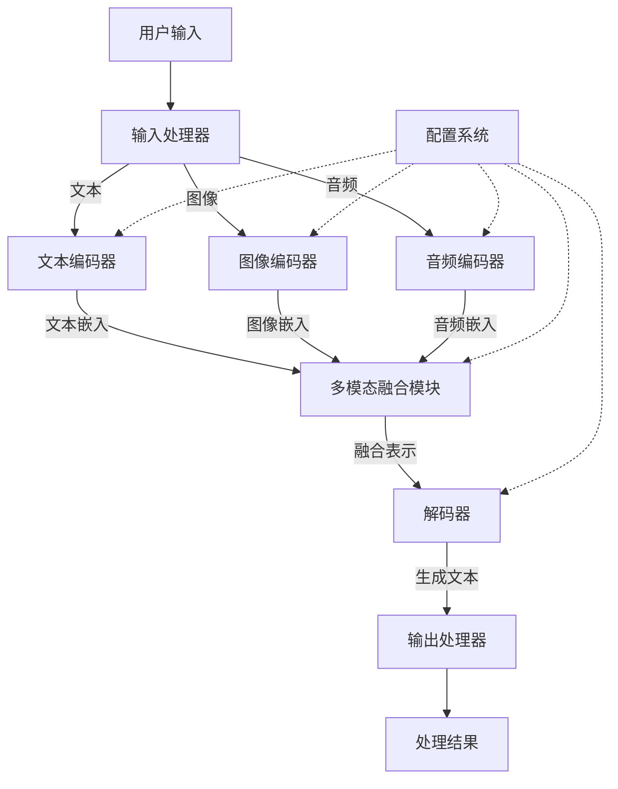

MultiSpaceAI 的总体架构由以下主要组件组成：

1. **输入处理器**：接收并预处理用户的多模态输入（文本、图像、音频）
2. **文本编码器**：将文本输入编码为高维嵌入
3. **图像编码器**：将图像输入编码为高维嵌入
4. **音频编码器**：将音频输入编码为高维嵌入
5. **多模态融合模块**：将不同模态的嵌入融合为统一表示
6. **解码器**：基于融合表示生成输出文本
7. **输出处理器**：处理和格式化最终结果
8. **配置系统**：为各个模块提供配置参数

## 输入处理流程

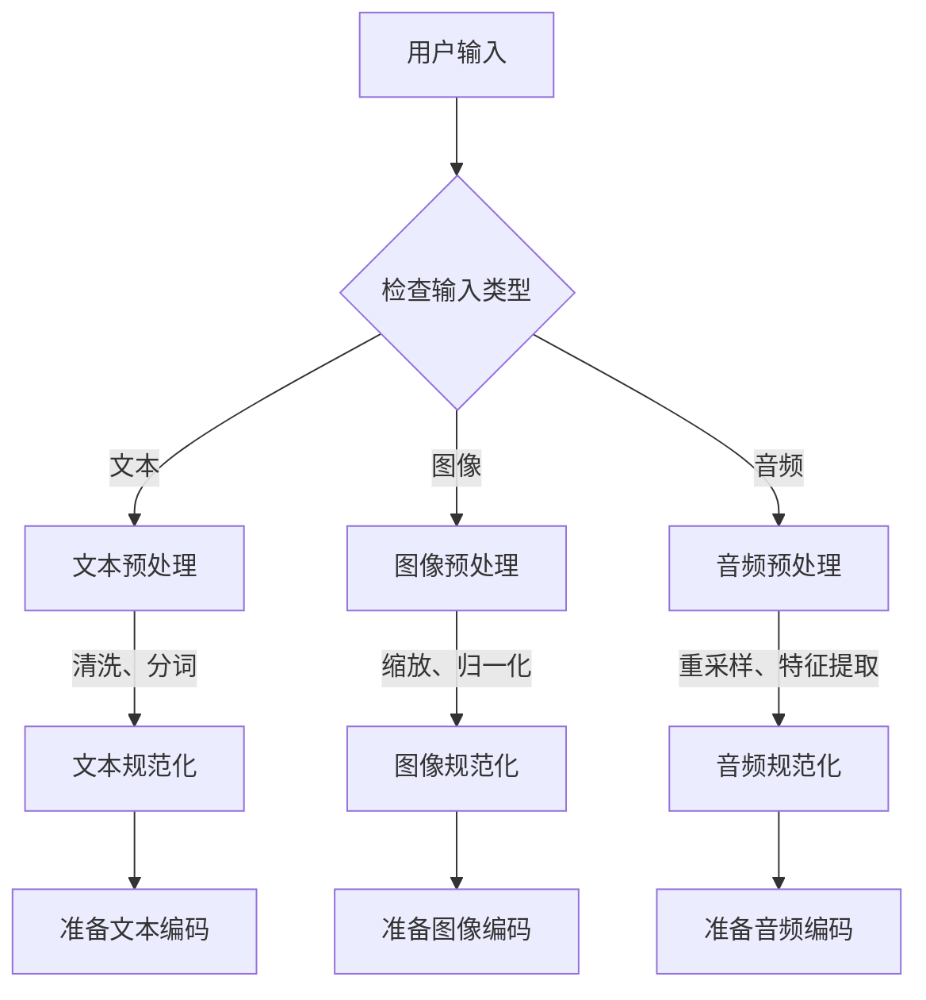

## 文本编码器模块

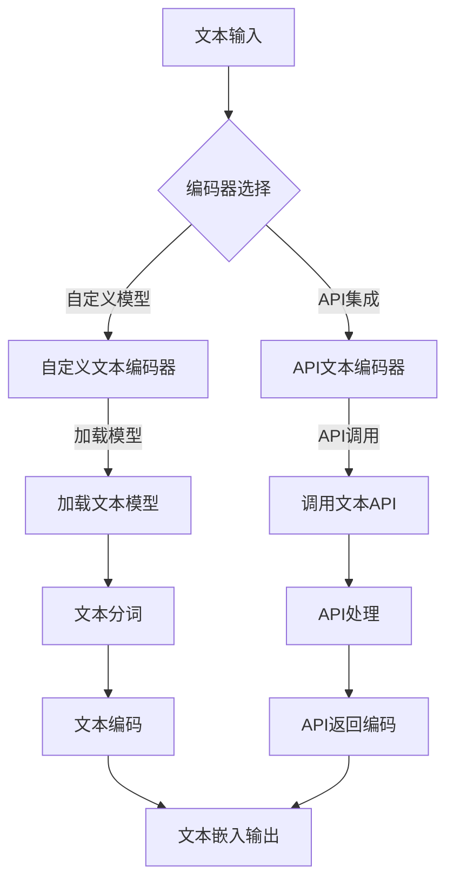

## 图像编码器模块

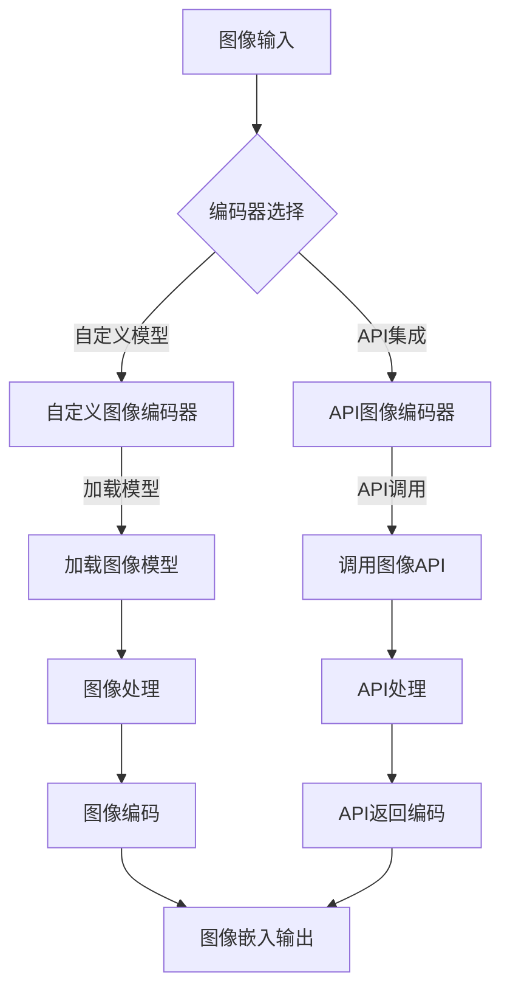

## 音频编码器模块

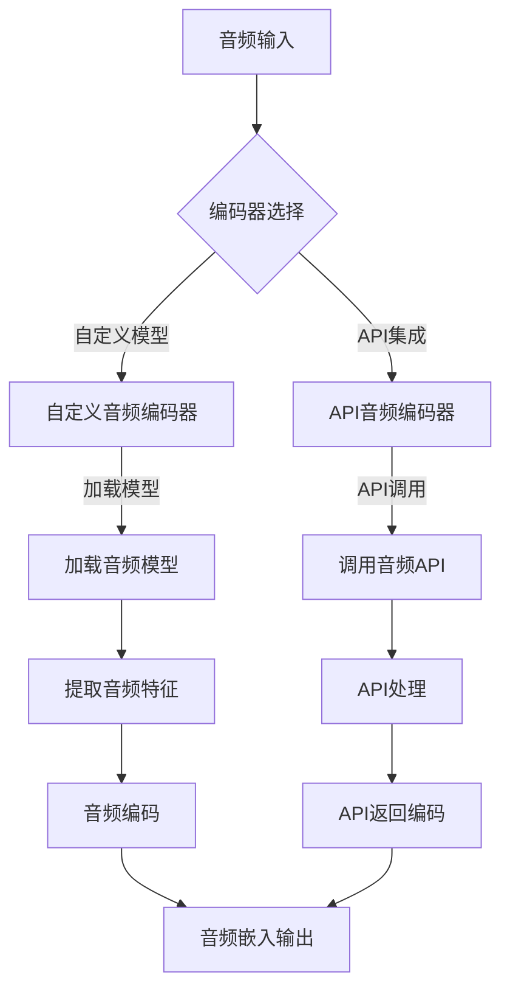

## 多模态融合模块

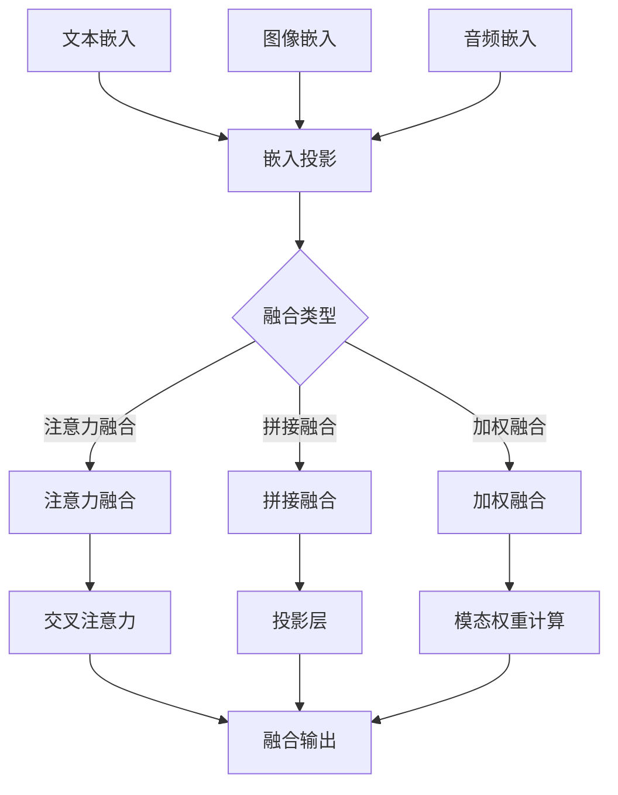

## 解码器模块

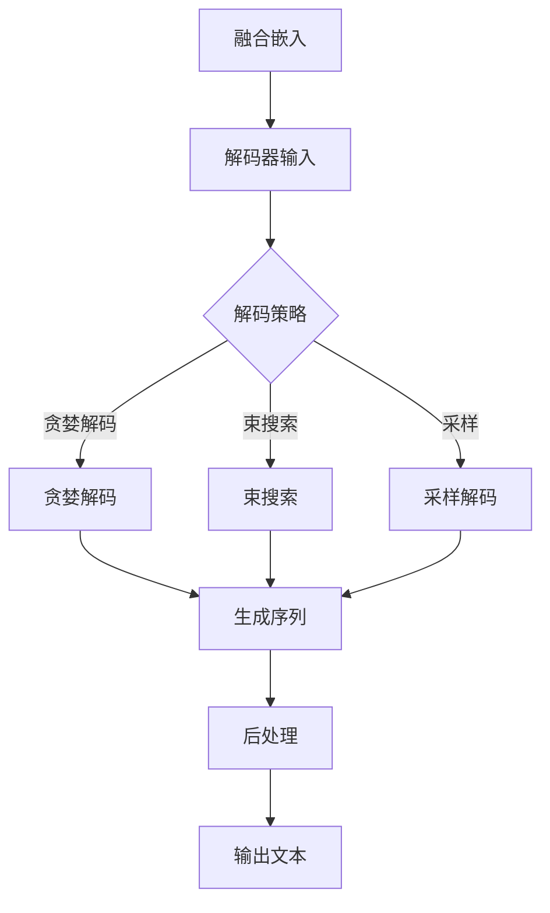

## 配置系统

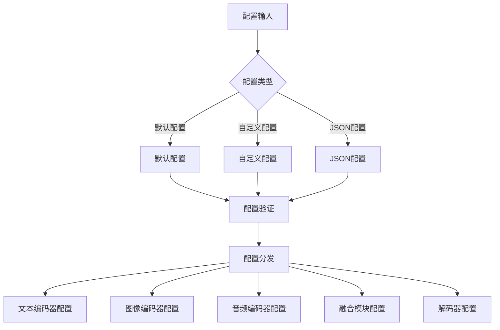

## 数据流程

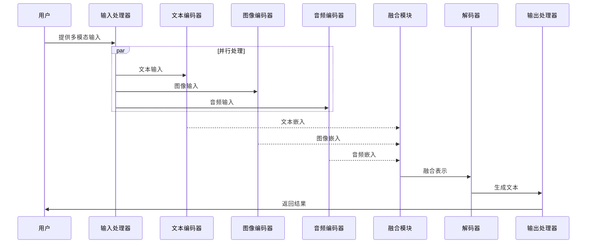

## 模型训练流程

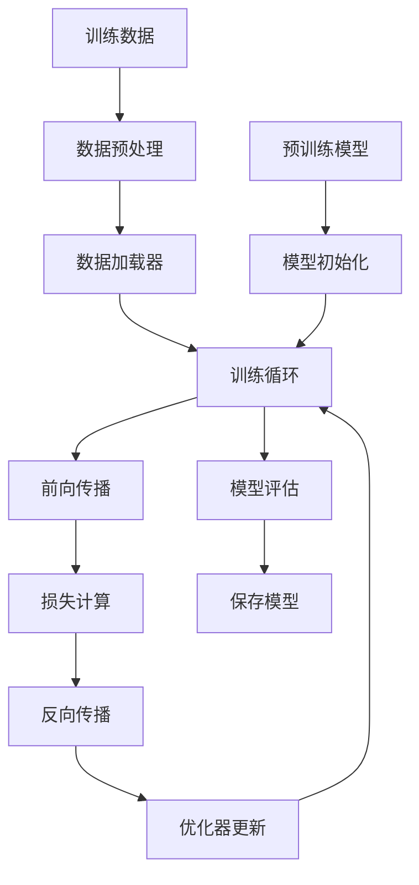

## API集成架构

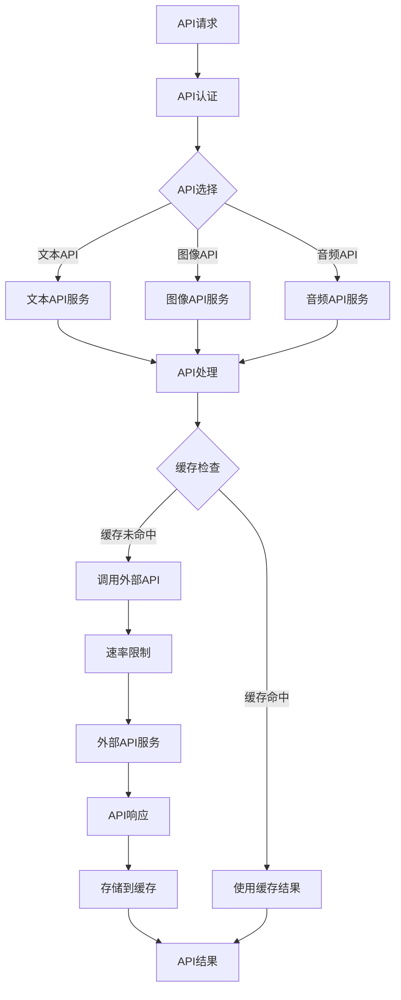